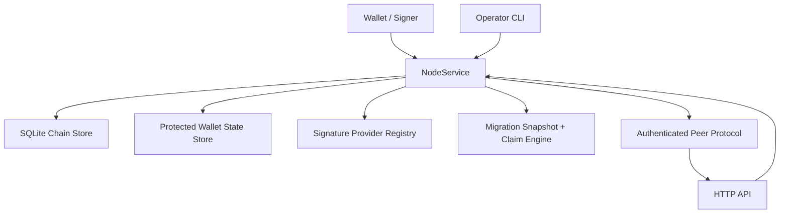
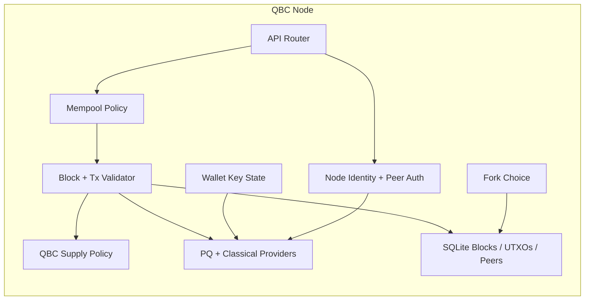
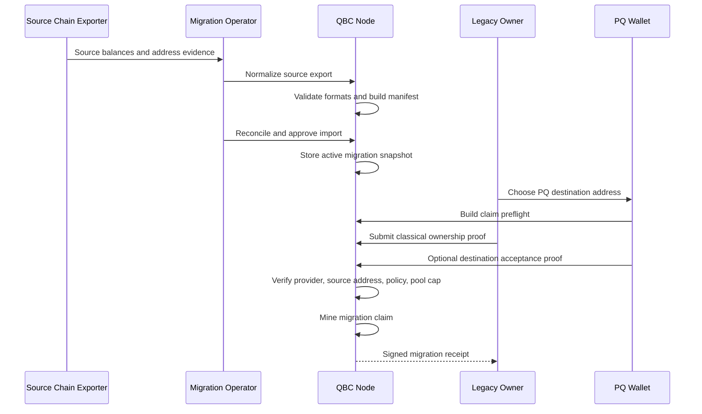
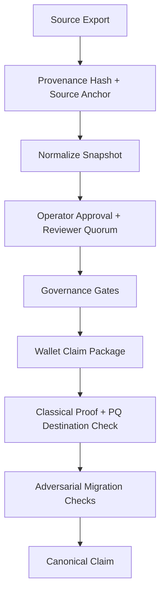
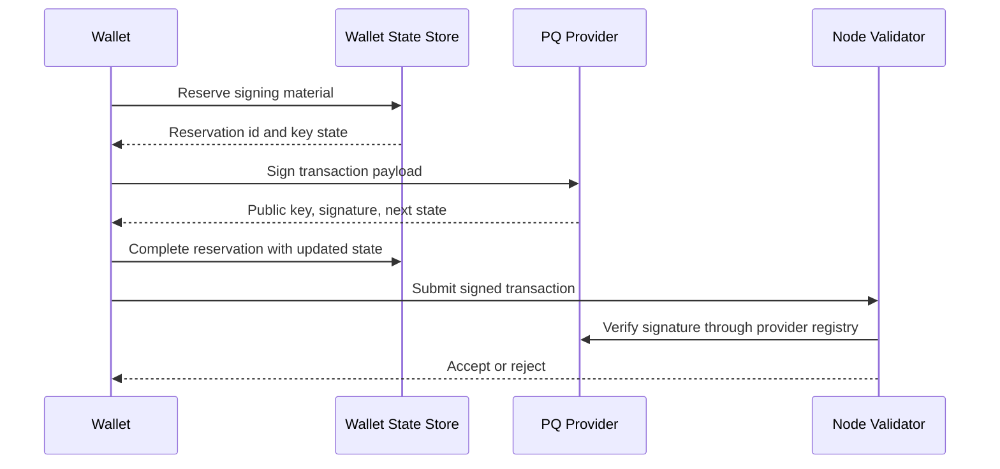
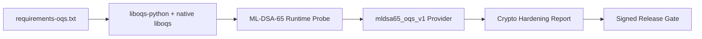

# Quantum-Resistant Blockchain

Quantum-Resistant Blockchain is a post-quantum-oriented blockchain node and protocol workbench for moving value from classical cryptographic systems into post-quantum-secure addresses. It combines a native capped currency, post-quantum signature provider boundaries, authenticated peer networking, persistent chain state, auditable migration snapshots, and safety tooling for stateful signing keys.

The native asset is **Quantum Blockchain Coin (QBC)**. QBC is configured with 8 decimals, a fixed 500,000,000 QBC supply cap, capped migration issuance, and height-based block rewards.

## Quick Start

```powershell
git clone https://github.com/AhmedMohammed100/quantum-resistant-blockchain.git
cd quantum-resistant-blockchain
python -m unittest discover -s tests -v
python main.py
```

Optional ML-DSA/OQS runtime path:

```powershell
$env:PYOQS_VERSION = "0.15.0"
python -m pip install --upgrade --force-reinstall --requirement requirements-oqs.txt
```

Useful contributor commands:

```powershell
python -m qr_blockchain protocol
python -m qr_blockchain migration-readiness
python -m qr_blockchain migration-integrity
python -m qr_blockchain currency
python -m qr_blockchain currency-supply
python -m qr_blockchain migration-networks
python -m qr_blockchain migration-report
```

The node starts an HTTP API on `127.0.0.1:8080` by default. Runtime state is stored under `data/` unless overridden with environment variables.

## Why This Matters

Most production blockchain systems still rely on ECC or RSA somewhere in their wallet, address, validator, or migration stack. A sufficiently capable quantum attacker would threaten those assumptions. This repository explores a practical transition path: keep familiar blockchain mechanics, but make migration into post-quantum-controlled addresses auditable, policy-driven, and eventually backed by standardized PQ signature libraries.

The project is not trying to fork Bitcoin, Ethereum, or another existing chain. It is building a separate chain with its own native currency and a migration layer that can cryptographically recognize ownership of supported classical source addresses.

## What It Solves

- **Post-quantum wallet direction:** wallet signing is abstracted behind provider interfaces so ML-DSA, XMSS, LMS, SPHINCS+, and other backends can be integrated without rewriting transaction validation.
- **Classical-to-PQ migration:** users can prove control of legacy ECC/RSA-style addresses and claim normalized QBC allocations into PQ destination addresses.
- **Auditable source snapshots:** migration data is imported as deterministic bundles with manifest hashes, review status, reconciliation, approval artifacts, and rollback evidence.
- **Stateful signer safety:** wallet state supports protected persistence and durable reservation coordination to avoid reusing one-time signing material.
- **Authenticated node sync:** peers use signed identities, admitted sessions, replay protection, framed requests, and chain-bound payloads.
- **Supply discipline:** QBC has a fixed 500M cap with explicit buckets for emissions, migration, treasury, security reserve, and public goods.

## What Makes It Different

- **Migration-first design:** the chain treats migration as a protocol feature, not a one-off token bridge script.
- **Provider boundaries before crypto lock-in:** the repo already separates transaction logic from PQ backend selection, making real XMSS/LMS/SPHINCS+ integrations cleaner.
- **Operational review built in:** source imports can be normalized, reconciled, approved, quarantined, revoked, audited, and signed.
- **Stateful PQ signing awareness:** the wallet layer accounts for crash safety and multi-process signer coordination, which matters for XMSS/LMS-style schemes.
- **Deterministic branch handling:** competing branches are stored, validated, and selected by deterministic cumulative-work fork choice.

## Current Maturity

This repository is **production-shaped, but not production-ready for public value**.

It currently has a real service architecture, persistent storage, API/CLI surfaces, authenticated peer flows, canonical supply accounting, migration policy, and a broad test suite. It also includes real classical migration verifier paths for secp256k1 and RSA PKCS#1 v1.5 SHA-256 ownership proofs.

The remaining maturity gap is mostly around audited cryptography, network hardening, consensus economics, production operations, independent review, and long-running multi-node testing.

## PQ Signature Backends

The project now has two classes of PQ signing providers:

- **Reference providers:** in-repo software providers used for development and deterministic tests, including `xmss_merkle_lamport_v1`.
- **External library providers:** provider boundaries that load a real cryptographic runtime when installed.

The first standardized stateless external target is `mldsa65_oqs_v1`, backed by Open Quantum Safe `liboqs` through the Python `oqs` bindings. It targets `ML-DSA-65`, the NIST FIPS 204 family formerly known through the CRYSTALS-Dilithium process. `Dilithium3` is treated as a compatibility alias for the same intended security level, but the preferred protocol-facing name is ML-DSA.

The existing XMSS, LMS/HSS, and SPHINCS+ provider boundaries remain available for hash-based and stateless PQ evolution. A node should treat a provider as usable only when `/crypto/providers` reports it as available.

See [docs/OQS_RUNTIME.md](docs/OQS_RUNTIME.md) for the pinned OQS runtime target and verification commands.

## Current Capability Stages

The latest migration-hardening work adds five production-path control surfaces:

- **Source provenance:** normalized source exports now include extractor metadata, source-chain anchors, record roots, and provenance hashes.
- **Governance gates:** migration policy now exposes dispute windows, reviewer quorum, emergency pause, blocked sources, and snapshot review state.
- **PQ runtime hardening:** the ML-DSA/OQS path has a pinned dependency file, runtime verification commands, and a hardening report for release gates.
- **Wallet claim packages:** wallets can request one package containing quote, preflight checks, claim intent hash, and exact messages to sign.
- **Adversarial simulation:** operators can run deterministic checks for duplicate claims, blocked snapshots, pool exhaustion, and claim uniqueness.

## Architecture



## Node Architecture



## Migration Flow



## Migration Assurance Flow



## PQ Signing Flow



## PQ Runtime Hardening Flow



## Native Currency: QBC

QBC uses a fixed supply cap of 500,000,000 coins.

| Bucket | Amount |
| --- | ---: |
| Migration pool | 200,000,000 QBC |
| Miner/validator emissions | 175,000,000 QBC |
| Ecosystem treasury | 75,000,000 QBC |
| Security reserve | 25,000,000 QBC |
| Public goods and liquidity | 25,000,000 QBC |

Default emission policy:

- Initial block reward: `175 QBC`
- Halving interval: `500,000` blocks
- Emission bucket cap: `175,000,000 QBC`
- Migration conversion model: `capped_pool_normalized_claims`

Migration claims do not mint unlimited 1:1 QBC against BTC, ETH, or other source balances. Source balances must be normalized by approved migration policy and draw from the capped migration pool.

## Security Model

The current security model is based on layered controls:

- **Chain-bound transactions:** signatures bind to the configured chain id to reduce cross-chain replay risk.
- **Provider-based verification:** transaction and migration signatures resolve through explicit provider registries.
- **Stateful signer coordination:** wallet state uses reservations so one-time signing material is not reused accidentally after process crashes or concurrent signing.
- **Protected key storage:** Windows deployments can protect wallet state with DPAPI; plaintext mode is explicitly development-oriented.
- **Authenticated peer exchange:** node identity, signed handshakes, admitted peer sessions, nonce replay protection, and payload digests protect peer RPCs.
- **Migration review gates:** snapshots and sources can be active, quarantined, or revoked before claims are accepted.
- **Governance pause and disputes:** operators can pause migration claims and expose dispute/reviewer windows through service reports.
- **Provenance-bound snapshots:** source exports carry deterministic provenance hashes and source-chain anchors before import.
- **Supply caps:** validation rejects blocks or claims that exceed configured QBC caps.

## Threat Model

The project currently focuses on these threats:

- Quantum attacks against classical address ownership and long-lived signing keys.
- Replay of transactions or peer requests across chains, sessions, or endpoints.
- Reuse of stateful PQ signing material after crashes, concurrent signing, or stale reservations.
- Malicious or corrupted migration snapshots that overstate balances or swap source addresses.
- Duplicate migration claims, blocked-source claims, and claims outside configured windows.
- Forks or reorgs that try to produce inconsistent UTXO, migration, or supply state.
- Mempool flooding through oversized, malformed, low-fee, or duplicate transactions.

Out of scope until later production hardening:

- DDoS-resistant public networking.
- Formal consensus security analysis.
- Slashing or validator-set economics.
- Hardware wallet integration.
- Independent cryptographic audit.
- Mainnet-grade incident response and key ceremony procedures.

## Production Readiness

Ready today:

- Local development nodes.
- API and CLI experimentation.
- Migration snapshot workflow testing.
- Provider adapter development.
- Multi-node authenticated sync experiments.
- QBC economics and supply-policy validation.

Not ready yet:

- Public mainnet value.
- Untrusted internet-scale peer networks.
- Custody of real user funds.
- Final consensus economics.
- Final audited PQ signature backend selection.
- Exchange, wallet, or validator production onboarding.

Before public value, the strongest migration gates are reproducible source-chain extraction, signed and independently reviewed migration snapshots, explicit conversion-ratio governance, broader real external-address proof coverage, and migration-specific load/reorg chaos testing.

## Run A Node

```powershell
python main.py
```

Common environment variables:

```powershell
$env:QR_CHAIN_DB_PATH = "data/chain.db"
$env:QR_CHAIN_WALLET_STATE_DB_PATH = "data/wallet_state.db"
$env:QR_CHAIN_HOST = "127.0.0.1"
$env:QR_CHAIN_PORT = "8080"
$env:QR_CHAIN_ID = "qr-chain-devnet"
$env:QR_CHAIN_NODE_ID = "node-a"
$env:QR_CHAIN_ADVERTISED_URL = "http://127.0.0.1:8080"
$env:QR_CHAIN_PEERS = "http://127.0.0.1:8081"
$env:QR_CHAIN_DEFAULT_SIGNATURE_PROVIDER = "xmss_merkle_lamport_v1"
python main.py
```

## API

Core endpoints:

- `GET /health`
- `GET /status`
- `GET /metrics`
- `GET /protocol`
- `GET /chain/summary`
- `GET /currency`
- `GET /currency/supply`
- `GET /crypto/providers`
- `GET /crypto/hardening`
- `GET /blocks?start_height=0`
- `GET /blocks/{height}`
- `GET /addresses/{address}/balance`
- `POST /genesis`
- `POST /transactions`
- `POST /mine`
- `POST /sync`

Migration endpoints:

- `GET /migration/policy`
- `GET /migration/governance`
- `GET /migration/adversarial`
- `GET /migration/networks`
- `GET /migration/report`
- `GET /migration/integrity`
- `GET /migration/readiness`
- `GET /migration/snapshots`
- `GET /migration/sources`
- `GET /migration/claims/receipt`
- `GET /migration/claims/quote`
- `GET /migration/claims/status`
- `POST /migration/source-exports/normalize`
- `POST /migration/source-exports/batch-normalize`
- `POST /migration/source-exports/runbook`
- `POST /migration/source-exports/manifest-status`
- `POST /migration/source-exports/approve`
- `POST /migration/source-exports/import-plan`
- `POST /migration/source-exports/import-approved`
- `POST /migration/snapshots/export`
- `POST /migration/snapshots/sign`
- `POST /migration/snapshots/import`
- `POST /migration/snapshots/reconcile`
- `POST /migration/snapshots/status`
- `POST /migration/sources/status`
- `POST /migration/claims/preflight`
- `POST /migration/claims/quote`
- `POST /migration/claims/package`

Peer endpoints:

- `POST /peer/handshake`
- `POST /peer/summary`
- `POST /peer/blocks`

## Operator CLI

```powershell
qr-chain migration-networks
qr-chain --db-path data/chain.db --wallet-state-db-path data/wallet_state.db protocol
qr-chain --db-path data/chain.db --wallet-state-db-path data/wallet_state.db crypto-hardening
qr-chain --db-path data/chain.db --wallet-state-db-path data/wallet_state.db migration-governance
qr-chain --db-path data/chain.db --wallet-state-db-path data/wallet_state.db migration-readiness
qr-chain --db-path data/chain.db --wallet-state-db-path data/wallet_state.db migration-integrity
qr-chain --db-path data/chain.db --wallet-state-db-path data/wallet_state.db migration-adversarial
qr-chain --db-path data/chain.db --wallet-state-db-path data/wallet_state.db currency
qr-chain --db-path data/chain.db --wallet-state-db-path data/wallet_state.db currency-supply
qr-chain --db-path data/chain.db --wallet-state-db-path data/wallet_state.db migration-source-export-normalize --input source-export.json --sign --output snapshot.json
qr-chain --db-path data/chain.db --wallet-state-db-path data/wallet_state.db migration-source-ingestion-import-plan --input snapshot.json --approval approval.json
qr-chain --db-path data/chain.db --wallet-state-db-path data/wallet_state.db migration-source-ingestion-import-approved --input snapshot.json --approval approval.json
qr-chain --db-path data/chain.db --wallet-state-db-path data/wallet_state.db migration-claim-quote --classical-address legacy-address
qr-chain --db-path data/chain.db --wallet-state-db-path data/wallet_state.db migration-claim-status --classical-address legacy-address
qr-chain --db-path data/chain.db --wallet-state-db-path data/wallet_state.db migration-claim-preflight --destination-address pq-address --classical-address legacy-address --classical-provider-id classical_claim_demo_v1 --source-network legacy-demo-ledger
qr-chain --db-path data/chain.db --wallet-state-db-path data/wallet_state.db migration-claim-package --destination-address pq-address --classical-address legacy-address --classical-provider-id classical_claim_demo_v1 --source-network legacy-demo-ledger
```

## Configuration Reference

Currency:

- `QR_CHAIN_CURRENCY_NAME`
- `QR_CHAIN_CURRENCY_SYMBOL`
- `QR_CHAIN_CURRENCY_DECIMALS`
- `QR_CHAIN_CURRENCY_BASE_UNIT`
- `QR_CHAIN_MINING_REWARD`
- `QR_CHAIN_SUBSIDY_HALVING_INTERVAL`
- `QR_CHAIN_GENESIS_SUPPLY_CAP`
- `QR_CHAIN_EMISSION_SUPPLY_CAP`
- `QR_CHAIN_MIGRATION_POOL_CAP`
- `QR_CHAIN_TREASURY_ALLOCATION_CAP`
- `QR_CHAIN_SECURITY_RESERVE_CAP`
- `QR_CHAIN_PUBLIC_GOODS_ALLOCATION_CAP`
- `QR_CHAIN_MIGRATION_CONVERSION_POLICY`
- `QR_CHAIN_REWARD_RECIPIENT_POLICY`
- `QR_CHAIN_MAX_MONEY`

Network and node:

- `QR_CHAIN_DB_PATH`
- `QR_CHAIN_HOST`
- `QR_CHAIN_PORT`
- `QR_CHAIN_ID`
- `QR_CHAIN_NODE_ID`
- `QR_CHAIN_ADVERTISED_URL`
- `QR_CHAIN_PEERS`
- `QR_CHAIN_MAX_ADMITTED_PEERS`
- `QR_CHAIN_PEER_ALLOWLIST`
- `QR_CHAIN_PEER_DENYLIST`
- `QR_CHAIN_REQUIRE_PEER_ALLOWLIST`
- `QR_CHAIN_PEER_PROTOCOL_VERSION`
- `QR_CHAIN_MAX_PEER_BLOCKS_PER_REQUEST`

Wallet and providers:

- `QR_CHAIN_DEFAULT_SIGNATURE_PROVIDER`
- `QR_CHAIN_PREFERRED_SIGNATURE_PROVIDERS`
- `QR_CHAIN_ALLOWED_SIGNATURE_PROVIDERS`
- `QR_CHAIN_MLDSA_BACKEND_MODULE`
- `QR_CHAIN_MLDSA_OQS_MECHANISM`
- `QR_CHAIN_WALLET_STATE_DB_PATH`
- `QR_CHAIN_WALLET_CUSTODY_MODE`
- `QR_CHAIN_WALLET_CUSTODY_SCOPE`
- `QR_CHAIN_WALLET_RESERVATION_TTL_SECONDS`

Migration:

- `QR_CHAIN_MIGRATION_CLAIM_START_HEIGHT`
- `QR_CHAIN_MIGRATION_CLAIM_END_HEIGHT`
- `QR_CHAIN_MIGRATION_DUAL_CONTROL_START_HEIGHT`
- `QR_CHAIN_MIGRATION_DUAL_CONTROL_END_HEIGHT`
- `QR_CHAIN_MIGRATION_DISPUTE_WINDOW_BLOCKS`
- `QR_CHAIN_MIGRATION_SNAPSHOT_REVIEWER_QUORUM`
- `QR_CHAIN_MIGRATION_EMERGENCY_PAUSE`
- `QR_CHAIN_MIGRATION_REQUIRE_SNAPSHOT_SIGNATURES`
- `QR_CHAIN_MIGRATION_ALLOWED_CLASSICAL_PROVIDERS`
- `QR_CHAIN_MIGRATION_TRUSTED_SNAPSHOT_SIGNERS`
- `QR_CHAIN_MIGRATION_TRUSTED_SNAPSHOT_NODES`

## Run Tests

```powershell
python -m unittest discover -s tests -v
```

## Roadmap

- Integrate audited, standards-aligned PQ backends for XMSS, LMS/HSS, SPHINCS+, and NIST-standard signature families where appropriate.
- Build reproducible Bitcoin/Ethereum source extraction pipelines for migration snapshots.
- Add stronger peer transport with encryption, rate limits, and peer scoring.
- Define validator/miner participation, governance, and reward distribution rules for QBC.
- Add long-running load, soak, chaos, and adversarial network tests.
- Add hardware-backed or isolated signer custody options.
- Produce public protocol specs for transaction format, migration claims, peer frames, and snapshot artifacts.
- Prepare signed releases, deployment guides, and migration operator playbooks.

## Changelog

Historical implementation phases were moved to [CHANGELOG.md](CHANGELOG.md).
